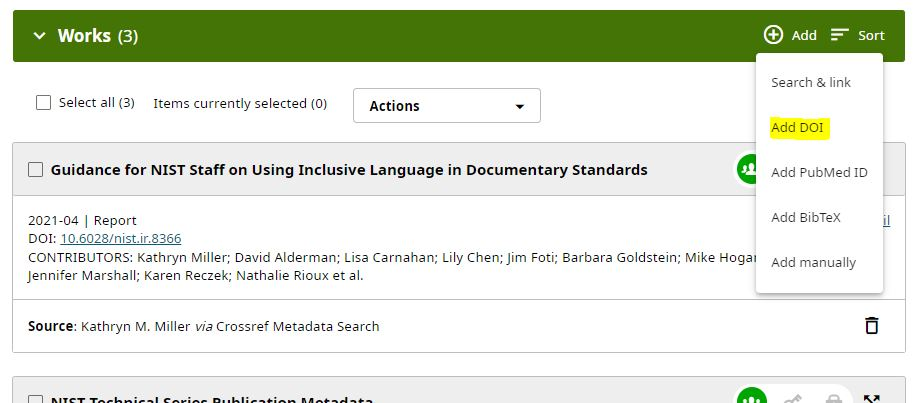
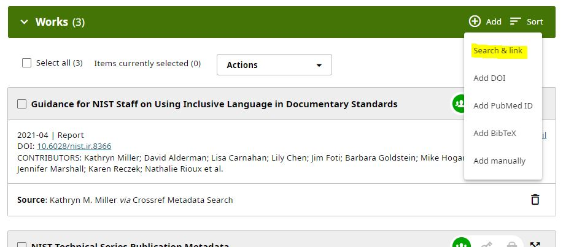
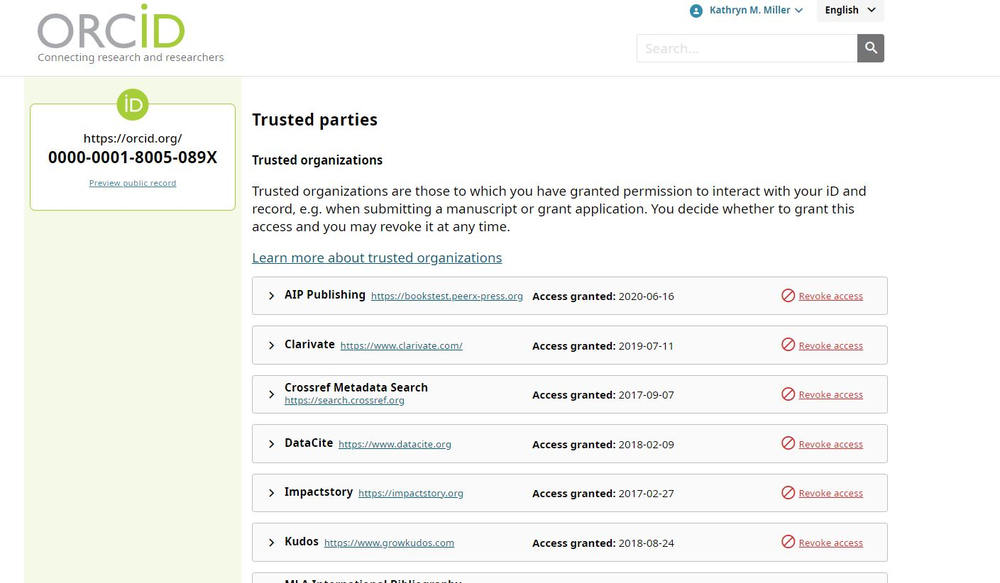
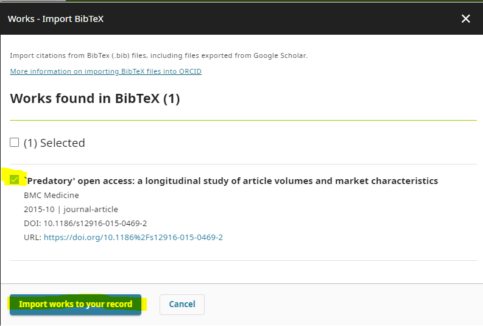

#  Adding Works to your ORCID profile

25 Minutes

---

## Learning Objectives

* Enter research contributions to the 'Works' section of your ORCID profile using three different methods
* Compare displayed citations added by these different methods
* Practice editing a record, once added from a preferred source
* Manage duplicate records

---

## Exercise 1. Add a work to your ORCID Profile using its Digital Object Identifier (DOI)

In the 'Works' section of your ORCID profile, click on the Tab '+ Add Works' and select the option 'Add DOI', as illustrated below:

A dialog box will display for 'ADD WORK', as illustrated below. In the blank text box, enter the DOI for the work you wish to add. The illustration below shows how to add a paper from Hugh Shanahan's ORCID profile, using the DOI `10.1016/j.cbpa.2009.04.470` but you are encouraged to add a DOI for your own work instead!

-----

Click on the blue button 'Retrieve work details' and a metadata form will display with details populated from the DOI record. Leave the form as is; scroll to the bottom to set the privacy to 'Trusted', and click 'Add to list'.

-----

Back in your ORCID profile, refresh the 'Works' section by clicking on the 'Sort' button and select 'Sort by Title'. Now look on the screen to view the work you just added. The illustration below shows the displayed version of Hugh Shanahan's work associated with `10.1016/j.cbpa.2009.04.470`.  

Note that at the bottom of this record in your ORCID 'Works' list, the 'Source:' is credited to your name. Because this record was added by you, you may edit this record to your heart's content.  In the bottom right corner of the record, click on the pencil icon to open up the record for editing. When the metadata template opens up, you may change a field or add data to an empty field. 

For this record, add a few words to the 'Description' field (for example, type "This is my paper" or "I borrowed this paper from Hugh for testing purposes"). Save and close the record.

-------------------------

## Exercise 2. Add a work to your ORCID Profile using the 'Search & link' tool

In the 'Works' section of the ORCID profile, click on the Tab '+ Add Works'. Select the option 'Search & link; a long list of searchable databases will display, as the illustration below shows.

Scroll to the link for "CrossRef Metadata Search".

The link takes you to the database for the CrossRef DOI Registration agency, while you are still logged into your ORCID account (see your name and the ORCID logo in the top right corner of the screen). Most publishers use CrossRef to register DOIs for their articles, book chapters, and proceedings.

In the search box at the top of the screen, enter the title for a work you wish to add to your ORCID. If you are following along using Hugh Shanahan's work as a test, enter the title for his journal article "How many extant pinniped species remain to be described?", as illustrated below.

Note that in the bottom right corner of the CrossRef record appears a little ORCID logo next to 'ADD TO ORCID'. Click this link to copy the record into your ORCID profile. You will be prompted to confirm that you wish to add this record to ORCID; click 'YES'.

Refresh your ORCID profile again, sort your 'Works' by title, and find the record you just added from 'Search & link'.  Note that at the bottom of this record the 'Source' is displayed as 'CrossRef Metadata Search'. Also note that you are not provided the pencil icon to edit this record. Instead, the icon in the bottom right corner is a 'fork' symbol -- meaning you can make a copy of the record and edit the copy. 

The CrossRef record is locked from editing because it is an authoritative data source. The records it supplies via 'Search & link' are guaranteed for accuracy, and the integration between ORCID and CrossRef is based on a trusted set of principles and business rules. Having 'trusted' data providers working with ORCID makes this system accurate and reliable!  

-----

## Exercise 3. Synch your ORCID with CrossRef 

The trusted integration between CrossRef and ORCID has another benefit: it allows your ORCID profile to automatically update whenever you publish a new work that has a CrossRef DOI!  And the publication metadata added to your ORCID will be accurate and authoritative.

### ORCID-CrossRef Synch Step 1.
To perform the synch step, return to CrossRef while you are still logged into your ORCID profile. Look for the ORCID icon and your name in the top right corner of the CrossRef screen, as shown below. Click on your name to display the drop-down menu.

### ORCID-CrossRef Synch Step 2.

Select 'Settings'

### ORCID-CrossRef Synch Step 3.

Confirm you wish to synch by clicking the orange 'Sync with ORCID' button.

### ORCID-CrossRef Synch Step 4.

Return to your ORCID profile and click on 'Trusted Parties' at near the top of the screen. You will now see that have authorized CrossRef to update your ORCID profile as your new publications are released. You may revoke this permission anytime by clicking the revoke access button displayed on the right side of the CrossRef permission.

-------------------------

## Exercise 4. Add a work to your ORCID Profile by uploading a BibTeX file

There is no universal coding format for scholarly citations: some systems use XML, others use JSON, and yet others use LaTeX and its bibliography syntax known as BibTeX. The ORCID system accepts BibTeX.

To get the BibTeX citation depends on the platform that provides the citation. Many publisher sites offer the option of downloading the citation in BibTeX. For this exercise, we will use the shen.bib BibTeX file we created in the [Digital Object Identifiers](00-intro-dois.html) lesson. 

### Step 1. 

Back in your ORCID profile in the 'Works' section, click on 'Add works' select the option to upload a BibTeX file, as shown below.

### Step 2. 

An upload prompt will display, click the button to browse to your desktop and select the file 'shen.bib'

Check the box of the record you want to add (there is only one record in the shen.bib file) and click the blue button to add the work to your ORCID profile.

The work is now added to your ORCID profile as a test!

## Exercise 5 (Mandatory!)

Delete any works you added that aren't yours because they were just for testing, and we understand the importance of giving credit where due! 

---

Previous: [Getting Started with ORCID](00-orcid-profile.html)
Next: [ORCID Benefits](02-orcid-benefits.html)
